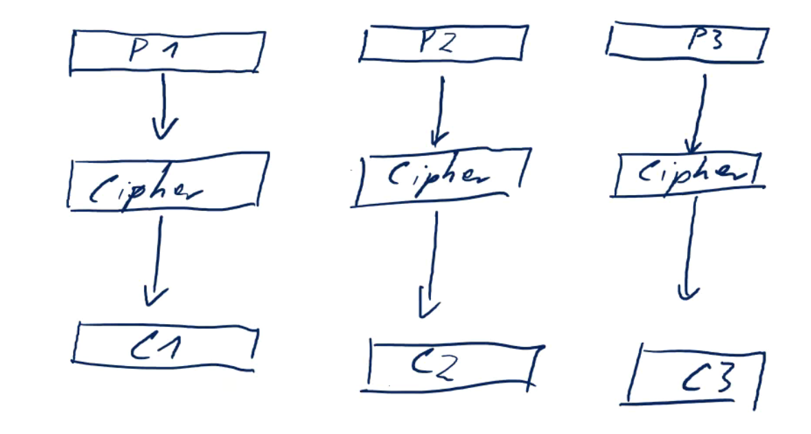
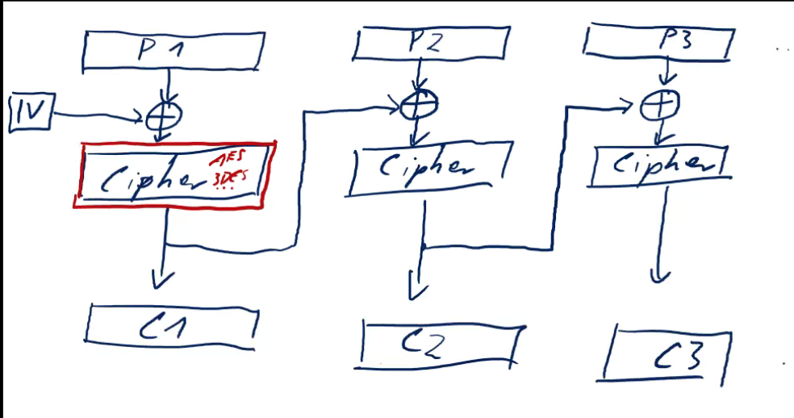
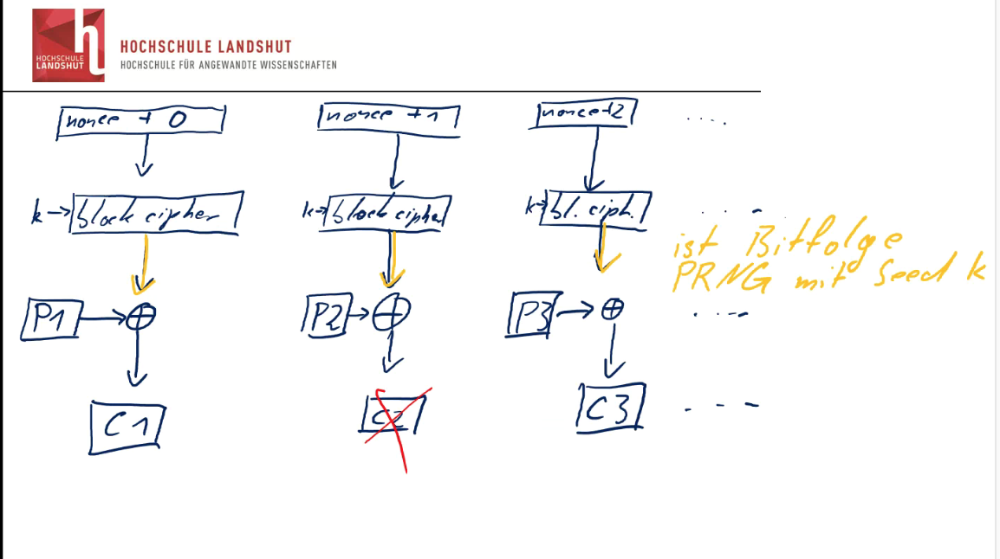

# <center> IT - Sicherheit 1 Zusammenfassung</center>
#### <center> Sassan Asnaashari</center>

Literatur:

* IT Sicherheit von Roland Hellmann
* IT Sicherheit von Claudia Eckert(nicht gut): Das Standart Buch aber nicht Herrn Uhrmanns
* [Sans](www.sans.org)
* [BSI]


## Kapitel 1 Begriffe
* Vertraulichkeit:
    * Zugriff auf Informationen ist auf autorisierte Personen begrenzt. Nicht autorisierte Personen können auf die Informationen nicht zugreifen. 
* Integrität:
    * Informationen dürfen nur von Personen verändert werden, die dazu autorisiert sind. Strengere Auslegung: Die Informationen müssen korrekt, konsistent und vor Manipulation geschützt sein.
* Verfügbarkeit:
    * Autorisierte Personen und Systeme können auf die Informationen und Ressourcen zugreifen, wenn diese benötigt werden

### Weitere Begriffe

Ein `Asset` (muss man beschützen) hat eine `Verwundbarkeit/Schwachstelle`
diese verursacht eine `Bedrohung`, welche auf den `Asset` wirken kann.

Die `Security Control` schützt den `Asset` verändert die `Bedrohung` und reduziert das `Risiko` (welches die `Bedrohung` bewertet).

* Bewertung von Schwachstellen druch CVSS.
* Security Controls : Deterrent(verringern), Preventive(entfernen von Schwachstellen), Detective(Erkennen und Loggen), Corrective(verringern des Schadens), Compensationg(Security Control, welches an der Stelle eines andern verwendet wird)
* Asset: Das was beschützt werden muss(Mensch, System, Organisation)
* Risiko: Kombination aus Warscheinlichkeit des Auftretens,Auswirkung, häufig (Bewertung meist schwer, daher: gering, mittel, hoch reicht)
* Angriff: passiv(sniffing[Daten unautorisiert lesen]), aktiv([Daten verändern, Komponenten verändern, oder Verfügbarkeit beeinträchtigen[denial of service attack])
* Verwundbarkeit" durch CVEs versehen bewertet durch CVSS
* Bedrohung: Arten, Quelle
* Arten von Schwachstellen:
    * Buffer Overflow
    * Fehlende Prüfung von Eingabedaten
    * SQL Injection: Injezieren von Schadcode
    * Race Condition: gerade bei multi-thread Programmen oder verteilten Systemen
    * Unsichere Dateioperationen (zb zeitliche Veränderung der DAten)
    * Fehlende/unzureichende Zugriffskontrollen
    * Organisitorische Schwachstellen

## Kapitel 2 Bewertungskriterien/Zugangskontrolle
### Bewerungskriterien

* Wie sicher muss das System sein?
* Messen von Sicherheit

      -> Dies führt zu Bewertungskriterienkatalog (TSEC Trusted Computer System Evaluation Criteria)
      * A - D von formaler Beweis bis kein/minimaler Schutz
      * Sensitivklassen eines Objekts / Sensitivklassen eines Subject ( Bis wie weit darf ich zugreifen)

### Zugriffskontrolle

* Discretionary Access Control:
    * Objekte sind Subjekten zugeordnet, diese entscheiden selber über Zugriffskontrollen (Betriebssystem)

    * Mandatory Access Control: 
        * Zugriffsbegrenzung anhand definierter Regeln
        * Security Police bilden die Menge aller Zugriffsregeln
        * Nutzer können die Regeln nicht ändern
        * SE Linux, AppArmor


### Sicherheitsmodelle

* Bell-LaPadula Sicherheitsmodell (Fokus Vertraulichkeit)
      (Einstufung (hängt an Datei) vs Clearance(hat eine Person [Ermächtigung]))

    * Auf einer Ebene `lesen und schreiben` erlaubt
    * `Read Down` erlaubt lesen von unten
    * `No Read Up` verbietet lesen als geheim von streng geheim
    * `Write Up` erlaubt schreiben nach oben
    * `No Write Down` soll verhindern, dass der Account Streng geheim nur für streng geheime Angelegeneheiten genutzt wird.

* Biba Sicherheitsmodell (Fokus Integrität)
    * Erlaubt Lesen und Schreiben auf einer Integritätseinstufung
    * Lesen von Informationen deren Einstufung über der Ermächtigung liegt
    * Schreiben von Informationene deren Einstufnug unterhalb der eigenen Ermächtigung liegt
    
    * Verbietet Lesen von Informationen deren Einstufung unterhalb der eigenen Ermächtigung liegen
    * Schreiben von Informationen mit Einstufung oberhalb der eigenen Ermächtigung

* Separation of Duties ( Mehrer Personen sind an Zugriffskontrollen beteiligt, Bei Gefahr Austausch oder rotierendes System)
* Least Privilege (Nur so viel KOntrolle wie nötig für die Aufgabe)
* Identifikation


## Kapitel 3
### ISO 9000/1
* Wir halten uns an unsere Vorgaben und haben diese dokumentiert
### ISO/IEC 15408 : Common Creteria
* Was erfüllt werden soll in PP
* Wie werden eigenschaften erfüllt : TOA
* Es werden `Produkte` zertifiziert
### Warum nicht immer EAL 7:
* sehr aufwendig
* nicht mgl
* oft ausreichend untere Studen zu nehmen
* Kosten und Dauer im Blick haben

### ISO 27001 : Infromation Security Managment Systems
* Es werden keine `Produkte` sondern `Systeme`(Organisatorisches System)
* Kontext der Organisation verstehen (Womit wird Geld verdient)
* Erwartungen -> defenierne
* Scope (was ist mit drin, was nicht)
* Anhang A: sind die Security Controls -> darum muss man sich `konkret` kuemmern

## Kapitel 4 Kryptographie
   -  überall vorhanden
   -  Maß von Zufallszahlen ist die Entropie. Am Besten wenn die Entropie Bits genauso lang sind die wie Zufallszahl:
   Zufallszahl 128 Bit -> Entropie 128 Bit.
   Das schafft man nur durch Hardware Zufallszahlen Generierung: Quantenrauschen
   


### Vorgehen
     1. Handschake
     2. Record Layer

### Symmetrische Verschlüsselung

* m und k müssen geheim gehalten werden
* der ganze Rest auf Folie 5
* gerade die Algorithmen nicht!!! Die sind mgl bekannt

### One time Key vs Multi use key
* OTK wird einmal genutzt
* MUK wird für mehrere Dokumente genutzt

### Hauptaufgaben von Krypto
     1. Sicherer Schlüsselaustausch
     2. Sichere Kommuniktation
     3. Verfügbarkeit ist `nicht` garantiert

### Weitere Aufgaben
     Digitale Signatur
     Anonyme Kommunikation
     ... Folie 10

### Allgemeines Vorgehen

1. Exakte Definition und Modellierung der Bedrohung
2. Vorschlag einer Konstruktion (Algorithmus, Protokoll, Nachrichten)
3. Beweis, dass der Bruch der Konstruktion bei der Bedrohung aus (1) identisch ist mit der Lösung eines zugrundeliegenden, schwierigen Problems

### Historische Verfahren
* Ersetzungstabellen
* Ceasar Chiffre
* Vigener Chiffre
* Rotor basierte Verfahren (Enigma) 2^18
* DES (Data Encryoten Standard) 2^56


### Diskrete Wahrscheinlichkeit

#### Wahrscheinlichkeitsverteilung

P sagt wie Wahrscheinlich ein bestimmmtes Byte ist...
Beispeil: deutscher Text  P('e') = 0.2
([0,1] -> zwischen 0 und 100 Prozent)
1. Gleichverteilung : alle 'x' treten gleich oft auf. ( gar nicht schlecht für Krypto ( Häufigkeitsangriff nicht mehr mgl))
2. Punktverteilung: ein Element tritt immer auf, und alle anderen Elemten treten dann nicht auf.
3. Verteilungsvector: Vector aus allen Wahrscheinlichkeiten. Evtl Peak erkennen

#### Ergeignis

* Teilmenge 
* Menge A ist ein Ergenis

zB Ereignis: Buchstabe ist Vokal.
lsb: least significant bit (unterstes Bit)
Beispiel: 
     
     da 00,01,11,10 mgl sind: 1/4 ist die Wahrscheinlichkeit

Weiters Beispie

     P(A), P(B)
     P(A || B) =  P(A) + P(B) nur falls sie sich nicht überlappen A n B = 0
     sonst P(A || B) <=  P(A) + P(B)


Randomisierter Algrorithmus:
     
    Ausgabe auf mehrere Elemente, m -> A(m) nicht immer das gleiche Element, da R dazu gerechnit wird. ( eine Zufalsvariablen)
    
XOR

     A= 0110111
     B= 1011010
        -------
     C= 1101101

     C = A + B

Weiter Eigenschaft von XOR: 

    es entseht aus einer nicht gleichverteilten und gleichverteilen Zufallsvariablen eine gleichverteile Zufalssvariablen


| X |Pr(X)|   
|---|---|         
| 0 |0.5|           
|1 | 0.5|                

|Y|P(Y)|
|---|---|
| 0 | ? |     
| 1 | ? |   

|Y | Pr(Z)|
|--|------|
|0 | (1 + 1) : 0.5 * Pr(Y = 1)
|  | (0 + 0) : 0.5 * Pr(Y = 0) 
|1 | (1 + 0) : 0.5 * Pr(Y = 1)
|  | (0 + 1) : 0.5 * Pr(Y = 0)

Plus(+) = Xor

     Pr(Z) = 0.5 * Pr(Y= 0) + 0.5 * Pr(Y = 1)
           = 0.5 * (Pr(Y=0) + Pr(Y=1))
           = 0.5 * 1
           = 0.5


XOR zerstört die Struktur und jedes Bit ist dann gleichverteilt. Wenn das X gleichverteilt ist.

## 4.1 Kryptographie : Stromchiffren
(Idee: Xor Gleichverteilung 0.5 -> ausgabeStrom alle Bist 0.5 Auftrittswahrscheinlichkeit)

### Symmetrischer Chiffren (Def)

Wenn ich etwas verschlüssel und wieder entschlüssel muss das gleiche rauskommen, beschreibt die komische Formnel unten...

### One Time Pad

     Plain Text mit einem Key mit XoR verschlüsselt = Chiffre
     c := m + k
     c + k = (m+k)+k = m + (k + k) = m + 0 = m 


Brechen: c1,c2

Wenn c1 und c2 den `gleichen` key haben. 
c1 = m1 + k
c2 = m2 + k

    -->  c1 + c2 = m1+k+m2+k 
                 = m1 + m2 (nicht mehr gleichverteilt) 
                 -> Musteranalysen (0 -> gleich, 1 -> verschieden)


Extremst schnell! XoR sind sehr leicht zu berechnen.
Key ist sehr lang.

### Sicherer Chiffre (Def)

- Perfekt Secrecy (Shennon) [Alles gleich wahrscheinlich]


Beweis: 
Antwort: genau einen: k = m + c
     
     Pr(E(k,m0)=c) = 1/|k|
     
     Pr(E(k,m1)=c) = 1/|k|

Ausprobieren der Schlüssel hilft nicht, da man dann nicht weiß welcher Schlüssel der richtige ist.

### Stromchiffren

* Kuerzerer SChluessel
* keine Perfekt Secrecy
* Da der Schlüssel nicht so lang wie die Nachricht sein soll
* Sicherheit hängt von der Eigenschaft des PRG ab
* mgl nichts ueber die naechste Zahl wissen, sie soll nicht vorhergesagt werden. Mathematisch nicht mgl.
* Schluessel zufaellig gewaehlt

#### Def Vorhersagbar

Ein Algo der polynomiales Laufzeitverhalten aufweist, kann das i-te Bit vorhersagen mit einer Wahrscheinlichkeit, die größer als 1/2 + Epsilon 

Darf nicht besser raten als Zufall

Schluessel kennt der Algo nicht

n : Soviele Bits kann PRG erzeugen

### OTP -> Stromchiffre
OTP 
* E = m xOr k
k lang
Stromchiffre
G(k)
* E = m xOr G(k)

Auch hier die Schluessel nicht wieder verwenden.
Kein Integritätsschutz, da der Angreifen die Info abfangen kann und veraendern kann. Gezielt an Bit Stellen etwas verändern.

### Diffie Hellmann

* kommutativ der hinteren beiden (nicht vollstaending)
* einfach auszurechnen, schwer umzukehren

* mindestens 2048 Bits lang
    - denn Rechenzeit: ca 3 Wochen fuer db, 60 s fuer berechnung // 512 Bit

#### LogJam Angriff

DHE_Export -> |p| <= 512bit

#### 

### Elliptic Curves
Motivation: Andere Zahlenmengen, die Eigenschaften erfuellen,die aber schneller sind.

Konkret: Mulitplikation in den elliptischen Kurven

Definition: 
* Kurve
* Startpkt G
* Q = n*G
* private Info: n
* oeffentlich: der Rest

* Meinst genutzte Kurve
```
Curve 252590, Bernstein Kurve
y^2 = x^3 + 486662 * x^2 + x
```
* Mathematische Definition der Operationen
```
*  Addition : 
    * Gerade durch beide Pkte
    * Schnittpkt  in einem dritten Pkt, muss gegeben sein, sonst Addition nicht mgl
    * Senkrechte und Wagerechte nicht defeniert?
    * Schnittppkt dann spiegeln, dann hat man P+Q
    * Pkt mit sich selbst: Tangente, SChnittpkt, Spiegelung
    * Das ist kommutativ
```

* Anwendung:
```
* Curve haben beide (Bernsteig-Lange Kurve)
* Startpkt haben auch beide (x=9)
* Zufaellige Ganzzahl dA, dB und multiplizieren das mit G
QA/B = dA/B * G
* QA und QB werden uebertragen
* X = dA*QB = dA*dB*G
* X = dB*QA = dB*dA*G

* Eve muestte Division durchfuehren, dA = QA/G, dafuer ist kein Algorithmus bekannt!!!! (Mit beserer Laufzeit als alle MGlkeiten durchzuprobieren.(nicht polynonimal))
```
--> Dadurch Sicherheitsniveau geben.

### Blockchiffren

Motiv: XoR am Einfachsten, mit PlainText und nicht vorhersagbaren Stromchiffren
Manchmal moechte man allerdings Bloecke verschluessseln:


Es muss gelten(Anforderungen): 
```
D(k,E(k,m)) = m
und 
2^n Klartext -> 2^n Ciphertext
--> bijektive Abbildung (Permutation)
```

#### Pseudo-Zufaellige Funktion vs Pseudo-Zufaellige Permutation

E: K x X -> X (X und X gleich, da 2^n Mgl auf 2^n Mgl abgebildet werden)
AES: K = X = {0,1}^128

### Feistel-Chiffren (BlockChiffren)
* Aufteilen
* Pro Run: 
    * L und R werden vertauschen
    * L_i+1 = Ri
    * R_i+1 = Li - Block xOR F(Ri,ki)

* Entschluessel:
    * L_i-1 = Ri xOr F(R_i-1,k_i-1)
    * R_i-1 = L_i
-> Somit Umkehrung gegeben

* Anforderung an F sehr gering. Muss nur Pseudo Zufaellige Funktion sein. Nicht auf Plaintext und Key kommen koennen, aber mehr auch nicht

#### Konfusion und S-Boxen

S-Boxen bringen Konfusionen, damit keine regelmaessigkeiten in den Bloecken herausgedfunden werden koennen. 
Nicht lineare Ersetzung. Durch eine Tabelle, oder Algo. Bijektiv. Muss Zufaellig sein

#### Diffusion und P-Boxen

PLaintext Bit aendern -> mgl die Haelfte im CiphertextBits aendern

Erst S-Box(Rundenschluessel ersetzt), dann P-Box(Positionen werden vertauscht)

Runden koennen in Hardware durchgefuehrt werden. Pro Runde 1 Assembler Befehl

Um Bloecke nun zu verhindern:(Mustervermeidung)
CBC Verschluesselung

### Verwendung von BlockChiffren 

* Electronik Code Block(ECB): Jeder Block wird identisch verschlüsselt
    - Es entstehen wieder Strukturen

    

* Cipher Block Chaining: Erst Xor mit Initialiserungsfaktor, dann immer mit dem vorgehenenden Block ve xOren.
    - Ein defekt führt zu 2 Defekten, da wir immer den Block davor brauchen
    - Entschlüsseln parallelisierbar
    - Verschlüsseln ist nicht parallelisierbar


* Counter Mode CTR
    - Nonce: Number used once(Zufallszahl)
    - Genauso sicher wie CBC
    - Vorteil : keine Fehlervortplflanzung der Fehler
    - Verschlüsseln: parralelisierbar
    - Entschlüsseln: parralelisierbar
    - Galois Counter Mode(Nachprüfung auf Veränderung auf dem Übertragungsweg) einer der häufigsten bei Übertragugnen im WEB
    - 



## Cloud Security

Man kommt nicht mehr daran vorbei!

### Was ist eine Cloud

* Eigenschaften die Cloud beschreiben (5)

* UNten was wir bekommen von der Cloud
* Oben was wir setzen müssen
* Prüfungsfrage: Rentiert sich Cloud nur falls pCloud < pRz -> Nein, weil nur genutze Resourcen in der Cloud bezahlt werden, vorrausgestzt die Anwendung so designt ist.

* Angriffsvektoren:
    - teschnische Hackes (klassisch)
    - phzsikalischer Hack (Bestechen, Erpressen, sich einstellen lassen)
    - Netzwerkpfade eingreifen
    - Controlle ueber Clients (Admin)

Beispiel:
(DDoS(Deniel of Service) -> Viele Bots, um Ablenkung zu schaffen)

* Cloud Security, preventive Massnahmen, siehe Folie. ( Die Zahlen sind die Zahlen auf der Folien mit den Hacks)

## Cloud IT Sicherheit (Sicherheitsneiveau entscheiden)
* Schutzniveau: Brauchen nicht sicherer sein als ich muss, aber auch nicht weniger sicher sein

* Typische Bewertungen gelten auch bei der Cloud
    * phzsikalisches ( Standort, Erdbeben) -> Policy des Kunden ueber Standortwahl, Entsorgung...
    * Zugriffskontrollen (Gebaeuder aber auch IT)
    * Datensicherung (halten, loeschen, ausfall)
    * Netzerksicherheit (uebrwachung(logging,monitoring))
    * Risiko und Vorfallsmanagment ueber Zertifizierungen ( Nur was im Scope steht wird zertifiziert)


